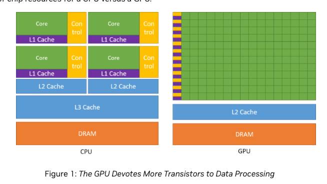
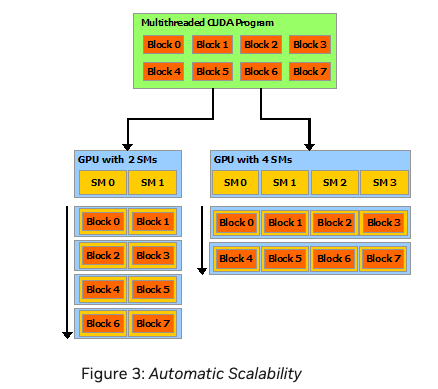
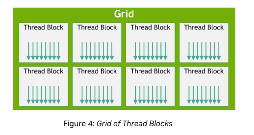

# Architecture and Programming Model

**CPU:** Execute sequence of operations as fast as possible
**GPU:** Execute small operations in parallel



**Takeway:**  In GPUs more transistors are dedicated to data processing 
rather than data caching 

**Concepts to remember**:

- Hierarchy of thread groups
- Shared Memories
- Barrier synchronization

Partition the problem into coarse sub-problems - solved by blocks of threads. Then,
each sub-problem is solved in parallel by threads within the block

**Takeaway:** Blocks contain threads and threads perform computation independently, but can collaborate



More multiprocessors = Faster program execution

SM - Streaming Multiprocessor

# Programming Model

Kernel is a function executed on a GPU. We can specify how many CUDA threads we can call to execute this kernel.

Example:

```
// Kernel definition
__global__ void VecAdd(float* A, float* B, float* C)
{
    int i = threadIdx.x;
    C[i] = A[i] + B[i];
}

int main()
{
    ...
    // Kernel invocation with N threads
    VecAdd<<<1, N>>>(A, B, C);
    ...
}
```

Here they used `__global__` prefix to the void function to define a kernel

Notice: When they call the kernel via `VecAdd<<1,N>>(A,B,C)` along with inputs they specify how many threads they want
to call. Here they use 1 block and N threads.

**Thread Hierarchy**

Threads are identified using `threadIdx`. We can have 1,2,3-D block of threads.

Thread index and thread ID relationships:

1D - thread index and thread ID is the same
2D - (Dx, Dy) (block size) - Thread id of index (x,y) is (x+y*Dx)
3D - (Dx,Dy,Dz) (block size) - Thread id of (x,y,z) is (x + yD*x + z*Dx*Dy)

The thread of a block can contain up to 1024 threads.

thread amount = threads-per-block * number_of_blocks



- Grid holds blocks
- Blocks hold threads

Thread blocks can be 1,2,3D and also grid holding blocks of threads can be 1,2,3 D

- Thread blocks must be able to execute independently.
- Threads within a block can share memory
- You can synchronize all threads within a block using `_syncthreads()`
